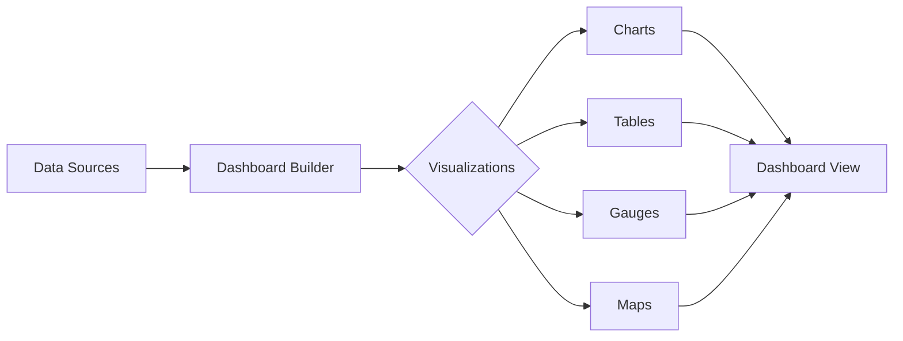

# Dashboards

Build custom dashboards with real-time metrics and visualizations.

## Dashboard Features

- Drag-and-drop builder
- Pre-built templates
- Real-time data updates
- Scheduled reports
- Sharing and collaboration
- Export functionality

## Visualization Types

- Line charts
- Bar charts
- Pie charts
- Heatmaps
- Data tables
- Geographical maps
