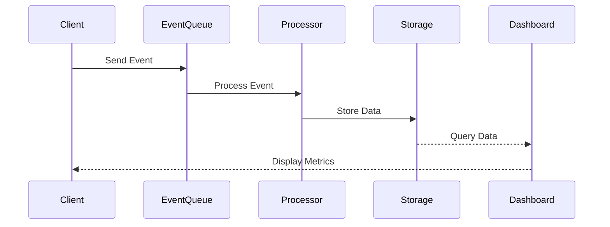

# Events & Tracking

Real-time event collection and processing pipeline.

## Event Types

- Page views
- User actions
- API calls
- Error events
- Custom events
- Performance metrics

## Tracking Implementation

- Client-side SDK
- Server-side tracking
- Batch processing
- Real-time streaming
- Data retention policies
