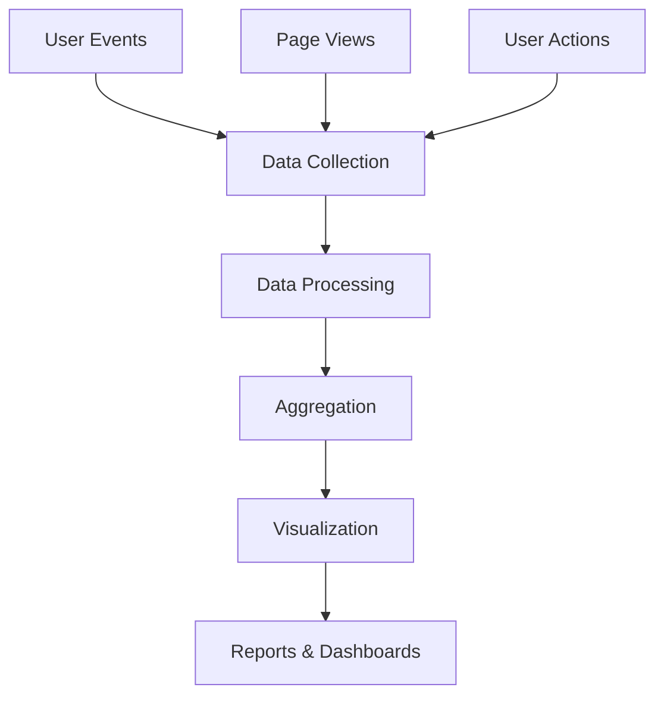

# Analytics

Comprehensive analytics platform for tracking user behavior, performance metrics, and business intelligence.

## Tracking Capabilities

- Real-time event tracking
- User behavior analysis
- Performance metrics
- Conversion funnel tracking
- Cohort analysis
- Custom event definitions

## Key Metrics

- Daily Active Users (DAU)
- Monthly Active Users (MAU)
- Retention rates
- Churn analysis
- Revenue attribution
- Feature usage statistics

## Integration Points

- **Data Warehouse**: BigQuery integration
- **Visualization**: Custom dashboard builder
- **Reporting**: Automated report generation
- **Alerting**: Real-time anomaly detection
