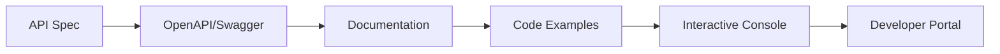

# API Documentation

Comprehensive API documentation and OpenAPI specification support.

## Documentation Features

- OpenAPI support
- Auto-generated docs
- Interactive API explorer
- Code examples
- Multiple languages
- Request/response samples
- Error codes
- Rate limit info

## API Specification

- OpenAPI 3.0
- Swagger 2.0
- JSON Schema
- Endpoint definition
- Request schemas
- Response schemas
- Authentication
- Headers and parameters

## Code Examples

- Multiple languages
- SDKs
- Client libraries
- Sample requests
- Sample responses
- Webhook examples
- Authentication examples

## Developer Portal

- API documentation
- Interactive explorer
- Code samples
- Quickstart guide
- Best practices
- FAQs
- Support resources
