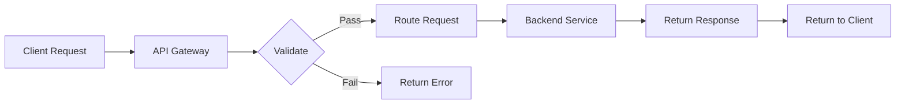

# API Gateway

Central API gateway for routing, rate limiting, and security.

## Gateway Features

- Request routing
- Load balancing
- Authentication
- Rate limiting
- Request transformation
- Response transformation
- Caching
- Compression

## Routing

- Path-based routing
- Host-based routing
- Method-based routing
- Custom routing rules
- API versioning
- Canary deployments
- Traffic splitting
- Fallback handling

## Rate Limiting

- Request throttling
- Per-user limits
- Per-API limits
- Quota management
- Burst allowance
- Rate limiting algorithms
- Custom rules

## Security

- API key validation
- OAuth authentication
- JWT validation
- CORS handling
- IP whitelisting
- Request validation
