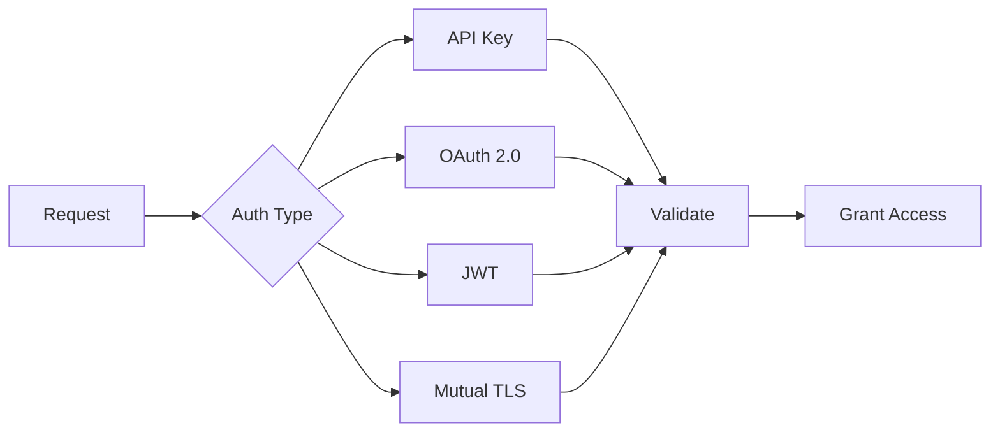

# Authentication & Security

Secure APIs with authentication and authorization.

## Authentication Methods

- API key authentication
- OAuth 2.0
- JWT tokens
- Mutual TLS
- Basic authentication
- Custom authentication
- HMAC signing
- Digital signatures

## Authorization

- Role-based access control
- Scope-based access
- Resource-based access
- Rate limiting
- Quota management
- Time-based access
- IP whitelisting

## Security Features

- HTTPS/TLS encryption
- API key rotation
- Token expiration
- Signing and verification
- Encryption at rest
- Audit logging
- Security headers
- CORS policies

## Compliance

- OAuth 2.0 compliance
- OpenID Connect
- FIPS compliance
- Industry standards
