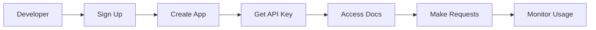

# Developer Portal

Self-service portal for API developers and partners.

## Portal Features

- User registration
- Application management
- API key generation
- API key management
- Documentation access
- Interactive API explorer
- Sandbox environment
- Code samples

## Developer Functions

- Create applications
- Manage API keys
- View documentation
- Test APIs
- Monitor usage
- View analytics
- Manage subscriptions
- Contact support

## Application Management

- App creation
- App configuration
- API key generation
- Rate limit configuration
- Webhook configuration
- Access control
- App suspension
- App deletion

## Support

- Documentation
- FAQ
- Support tickets
- Community forums
- Code samples
- Tutorials
