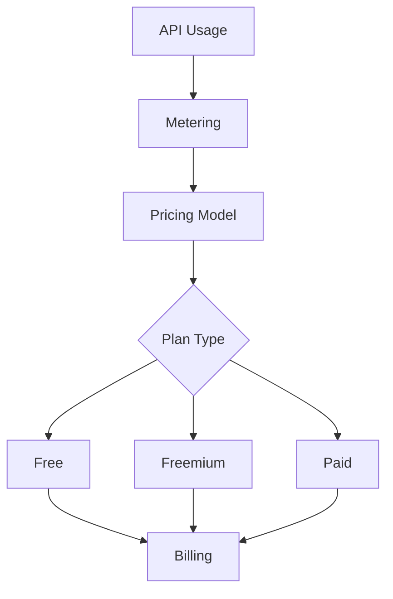

# Monetization

Monetize APIs with flexible pricing and billing models.

## Pricing Models

- Free tier
- Freemium
- Per-request pricing
- Tiered pricing
- Usage-based pricing
- Subscription pricing
- Hybrid models
- Custom pricing

## Billing Features

- Usage metering
- Rate calculations
- Invoice generation
- Payment processing
- Billing history
- Overage handling
- Tax calculations
- Revenue recognition

## Plans

- Starter plan
- Professional plan
- Enterprise plan
- Customizable plans
- Trial periods
- Plan upgrades
- Plan downgrades
- Plan cancellation

## Analytics

- Usage tracking
- Revenue metrics
- Customer lifetime value
- Churn analysis
- Conversion metrics
- Plan migration
- Payment analytics
