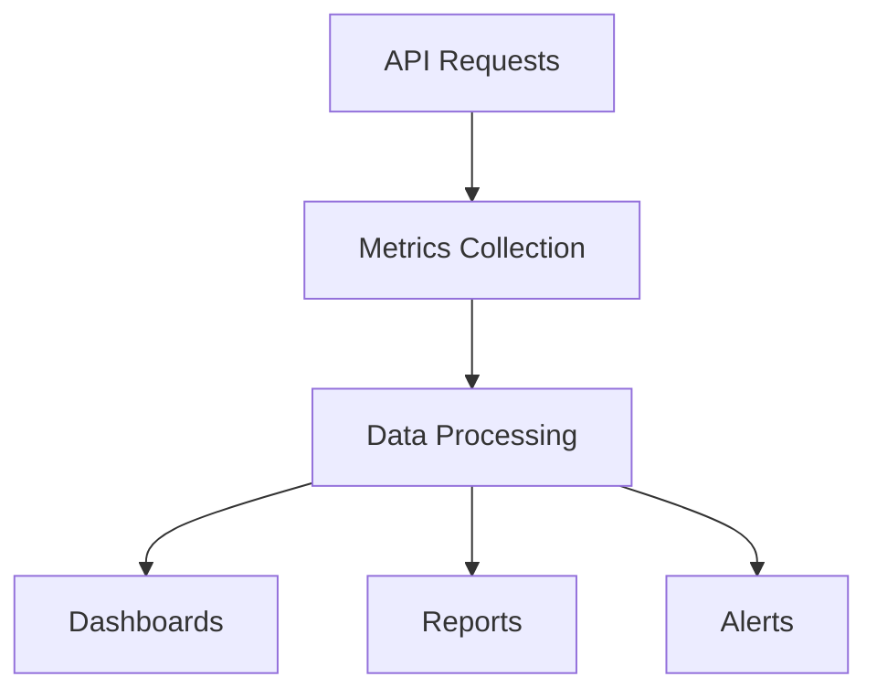

# Monitoring & Analytics

Monitor API performance and analyze usage patterns.

## Monitoring Features

- Real-time monitoring
- Performance metrics
- Error tracking
- Latency tracking
- Request logging
- Response logging
- Error rate monitoring
- Health checks

## Key Metrics

- Request volume
- Response time
- Error rate
- Success rate
- Availability
- Peak load
- Bandwidth usage
- Active users

## Analytics

- Usage trends
- Endpoint popularity
- Error analysis
- Performance analysis
- User behavior
- Adoption metrics
- Revenue metrics

## Dashboards

- Real-time dashboard
- Performance dashboard
- Usage dashboard
- Error dashboard
- Custom dashboards
- Executive summary

## Alerts

- Performance alerts
- Error alerts
- Usage alerts
- SLA violations
- Custom alerts
