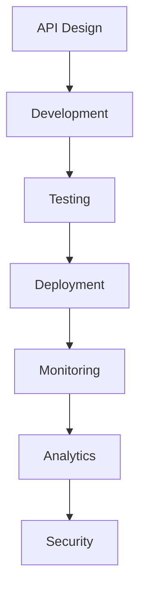

# API Management

Complete API management platform for building, deploying, and monitoring APIs.

## Core Features

- API design and documentation
- API gateway
- API authentication
- Rate limiting
- API versioning
- API analytics
- API monetization
- Developer portal

## API Operations

- API creation
- Endpoint management
- Request/response mapping
- Error handling
- API versioning
- Deprecation
- Lifecycle management

## Integration Points

- **Security**: Authentication
- **Analytics**: API metrics
- **Notifications**: API alerts
- **Integrations**: Third-party APIs
