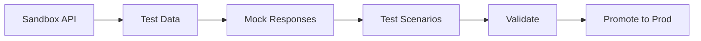

# Testing & Sandbox

Sandbox environment for testing APIs before production.

## Sandbox Features

- Isolated environment
- Test data
- Mock responses
- Realistic latency
- Rate limiting
- Error injection
- Test utilities
- Reset functionality

## Testing Capabilities

- Unit testing
- Integration testing
- Load testing
- Performance testing
- Security testing
- Compatibility testing
- Regression testing
- Contract testing

## Test Data

- Sample data
- Realistic scenarios
- Edge cases
- Error conditions
- Large datasets
- Data reset
- Data seeding

## Test Utilities

- API explorer
- Request builder
- Response viewer
- Performance profiler
- Error simulator
- Load generator
- Validation tools

## Promotion

- Test results
- Validation checks
- Code review
- Approval workflow
- Deployment plan
- Rollback plan
