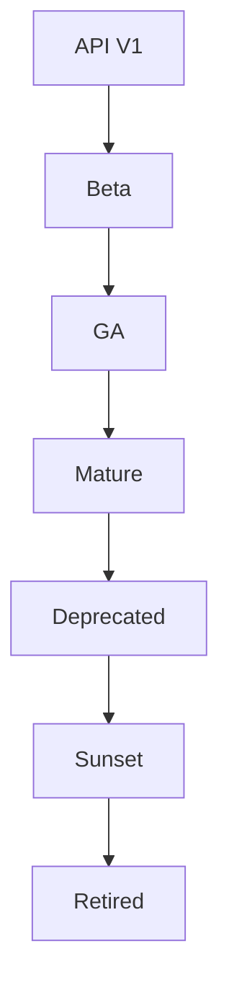

# Versioning & Lifecycle

Manage API versions and handle API lifecycle.

## API Versioning

- Semantic versioning
- URL versioning
- Header versioning
- Parameter versioning
- Multiple versions
- Version routing
- Backward compatibility
- Migration guides

## Lifecycle Stages

- Development
- Beta
- General Availability
- Mature
- Deprecated
- Sunset
- Retired

## Deprecation

- Deprecation notice
- Migration period
- Documentation updates
- Client notification
- Support timeline
- Sunset date
- Redirect handling

## Version Management

- Version creation
- Version promotion
- Version documentation
- Version support
- Migration tools
- Compatibility checking
