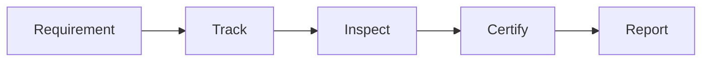

# Compliance & Certification

Asset compliance and certification.

## Features

- Compliance requirements
- Inspection scheduling
- Certification tracking
- Audit readiness
- Documentation
- Non-compliance alerts
- Renewal tracking
- Compliance reporting
