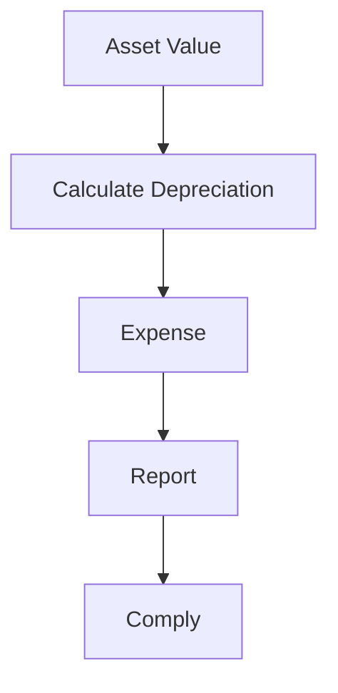

# Depreciation & Accounting

Asset depreciation and accounting.

## Features

- Depreciation calculation
- Accounting methods
- Book value tracking
- Accumulated depreciation
- Asset retirement
- Impairment tracking
- Financial reporting
- Tax compliance
