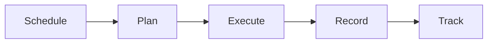

# Maintenance Management

Asset maintenance management.

## Features

- Maintenance scheduling
- Preventive maintenance
- Corrective maintenance
- Maintenance history
- Cost tracking
- Service request management
- Work order creation
- Maintenance analytics
