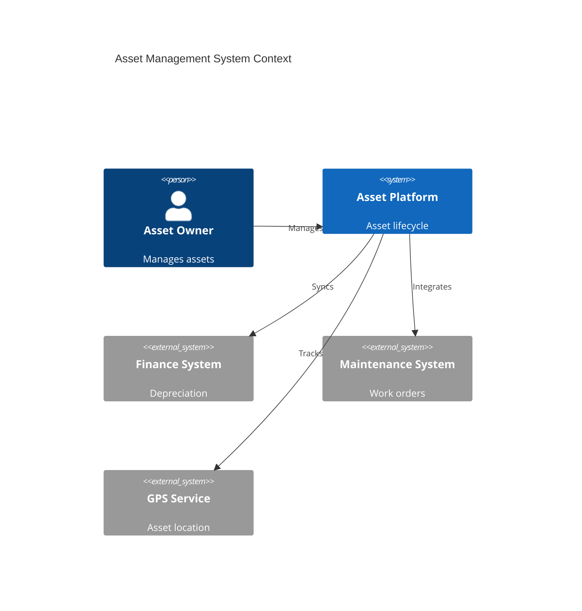
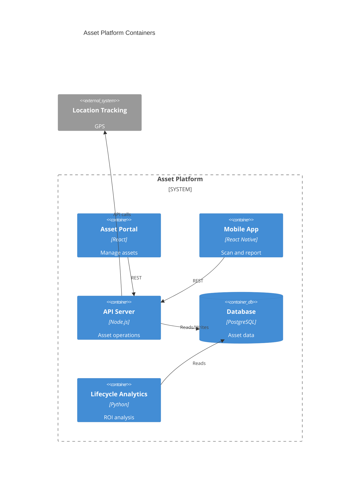
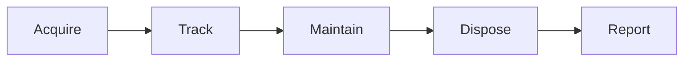

# Asset Management

Asset lifecycle and tracking.

## System Context

## System Containers

## Overview

## Features

- Asset registry
- Lifecycle tracking
- Depreciation calculation
- Maintenance schedules
- Location tracking
- Barcode/RFID tagging
- Compliance tracking
- Asset analytics
