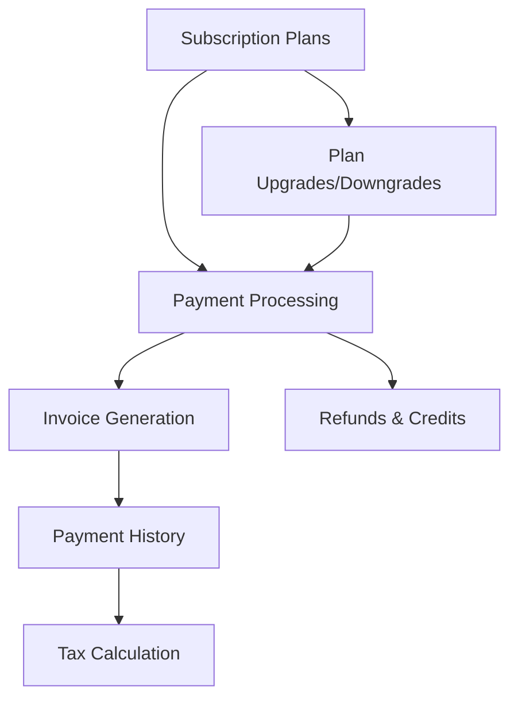

# Billing

Comprehensive billing system for managing subscriptions, payments, and invoicing.

## Core Features

- Multiple subscription tiers
- Automated billing cycles
- Invoice generation and delivery
- Payment processing via Stripe
- Refund and credit management
- Tax and compliance handling

## Integration Points

- **Payment Gateway**: Stripe integration
- **User Management**: Customer account linking
- **Notifications**: Payment confirmations and reminders
- **Reporting**: Financial analytics
