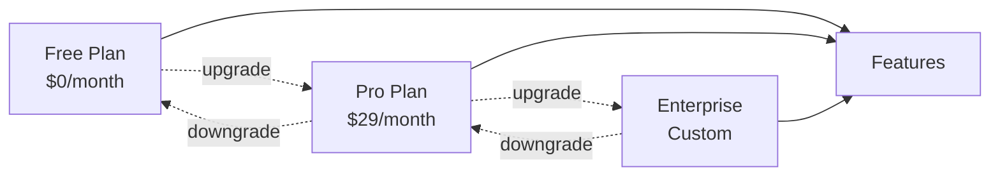

# Subscription Plans

Define and manage multiple subscription tiers for your customers.

## Available Tiers

| Plan | Price | Users | Storage |
|------|-------|-------|---------|
| Free | $0 | 1 | 1GB |
| Pro | $29 | 10 | 100GB |
| Enterprise | Custom | Unlimited | Unlimited |

## Feature Allocation

- Usage limits per tier
- Feature gating based on subscription
- Upgrade/downgrade handling
- Trial period management
