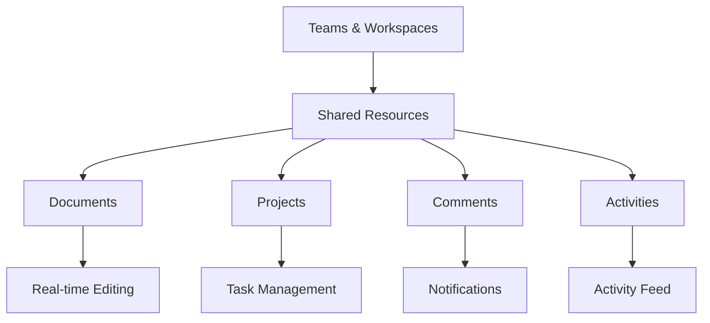

# Collaboration

Comprehensive collaboration platform for teams to work together effectively.

## Core Features

- Team workspaces
- Shared documents
- Real-time collaboration
- Comments and mentions
- Activity tracking
- Task assignments
- File sharing
- Discussion threads

## Workspace Management

- Create and manage teams
- Member invitations
- Role-based access
- Workspace permissions
- Team settings
- Resource allocation

## Communication

- Comments on documents
- Inline discussions
- @mentions
- Notification management
- Activity notifications
- Email summaries

## Integration Points

- **User Management**: Team membership
- **Content Management**: Document storage
- **Notifications**: Activity alerts
- **Analytics**: Usage tracking
