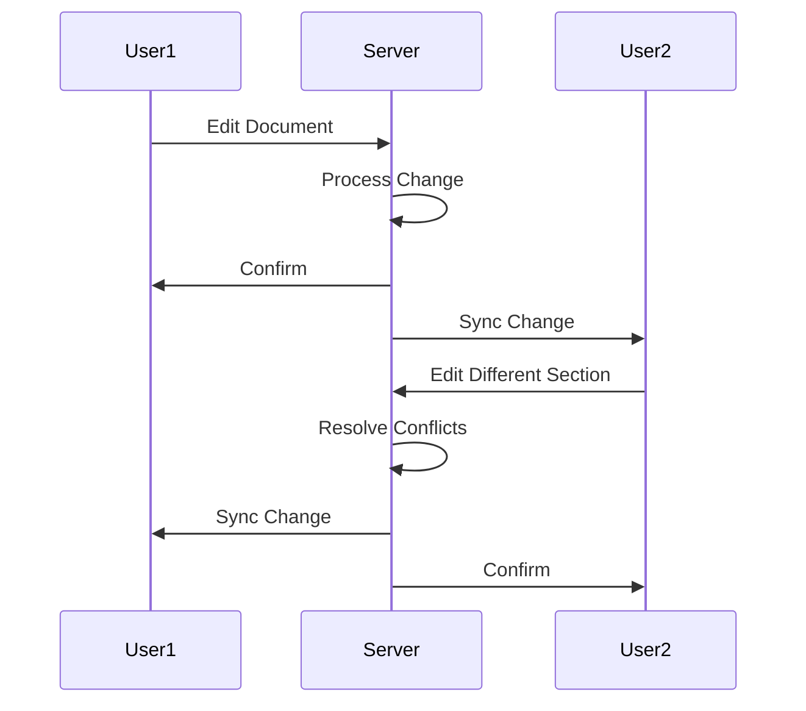

# Real-time Editing

Synchronous document editing with conflict resolution and version control.

## Editing Features

- Simultaneous editing
- Live cursor tracking
- Automatic conflict resolution
- Undo/redo support
- Version history
- Change suggestions
- Formatting tools

## Synchronization

- Real-time updates
- Operational transformation
- Conflict-free replicated data type
- Latency optimization
- Offline support

## Version Control

- Version history
- Version comparison
- Restore to previous version
- Branching
- Merging
- Change attribution
