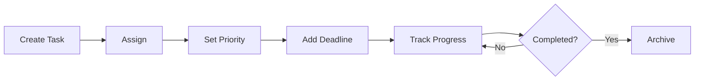

# Task Management

Integrated task management for organizing and tracking work.

## Task Features

- Task creation and editing
- User assignment
- Priority levels
- Due dates
- Status tracking
- Task dependencies
- Subtasks
- Checklists

## Organization

- Projects and boards
- Lists and sprints
- Custom categories
- Tags and filters
- Search functionality
- Bulk operations

## Tracking

- Progress indicators
- Time tracking
- Comments and updates
- Activity history
- Notifications
- Status changes
- Reminder management

## Integration

- Calendar integration
- Notification alerts
- Activity feed
- Report generation
