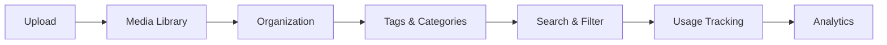

# Media Library

Centralized media management for images, videos, and documents.

## Supported Formats

- **Images**: JPG, PNG, GIF, WebP, SVG
- **Videos**: MP4, MOV, WebM, MKV
- **Documents**: PDF, DOCX, XLSX, PPTX
- **Archives**: ZIP, RAR

## Features

- Drag-and-drop upload
- Batch operations
- Image optimization
- Video transcoding
- Metadata extraction
- CDN delivery
- Access control

## Organization

- Folders and collections
- Tags and categories
- Search functionality
- Advanced filters
- Custom metadata
- Usage tracking
