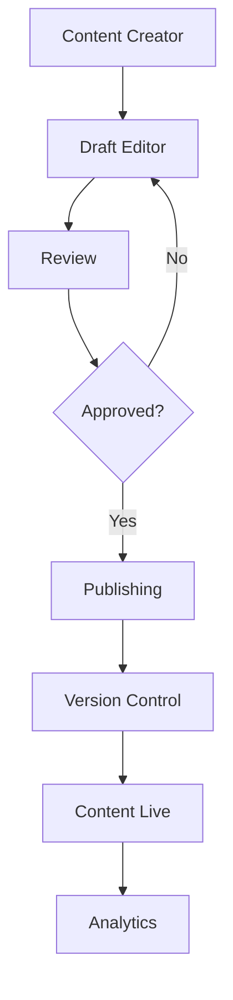

# Content Management

Flexible content management system for creating, editing, and publishing content.

## Content Types

- Blog posts
- Pages
- Documents
- Media files
- Collections
- Reusable components

## Features

- WYSIWYG editor
- Rich text editing
- Media management
- Version history
- Scheduled publishing
- Content preview
- SEO optimization

## Workflow

- Draft creation
- Multi-step review process
- Approval workflows
- Change tracking
- Content scheduling
- Publishing workflows

## Integration Points

- **Analytics**: Track content performance
- **Notifications**: Publishing alerts
- **Security**: Access control
- **Integrations**: Syndication feeds
