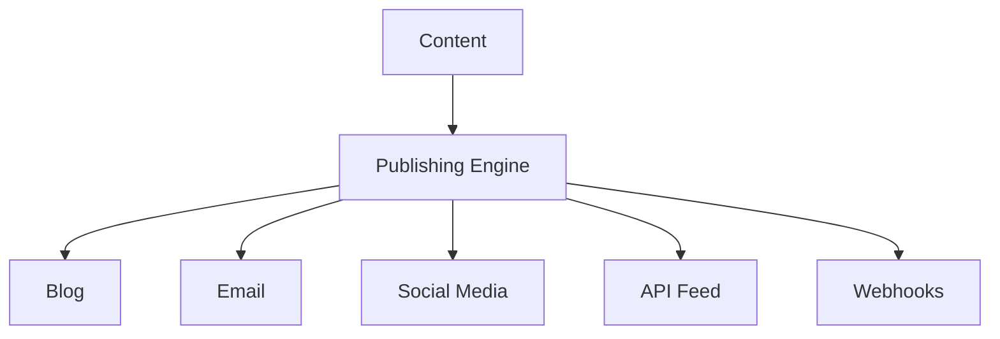

# Publishing

Multi-channel publishing system for distributing content.

## Publishing Channels

- Website/Blog
- Email newsletters
- Social media platforms
- API feeds
- Mobile app
- External platforms

## Features

- Scheduled publishing
- Queue management
- Publishing history
- Rollback capability
- Auto-social posting
- Feed generation
- Notification on publish

## Distribution

- Immediate publishing
- Scheduled publishing
- Recurring publishing
- Conditional publishing
- Audience targeting
