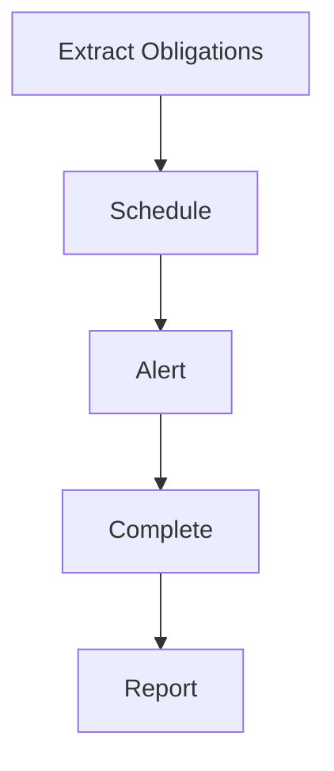

# Obligation Tracking

Contract obligation tracking.

## Features

- Obligation extraction
- Automatic scheduling
- Alert system
- Task assignments
- Completion tracking
- Milestone tracking
- Escalation rules
- Historical records
