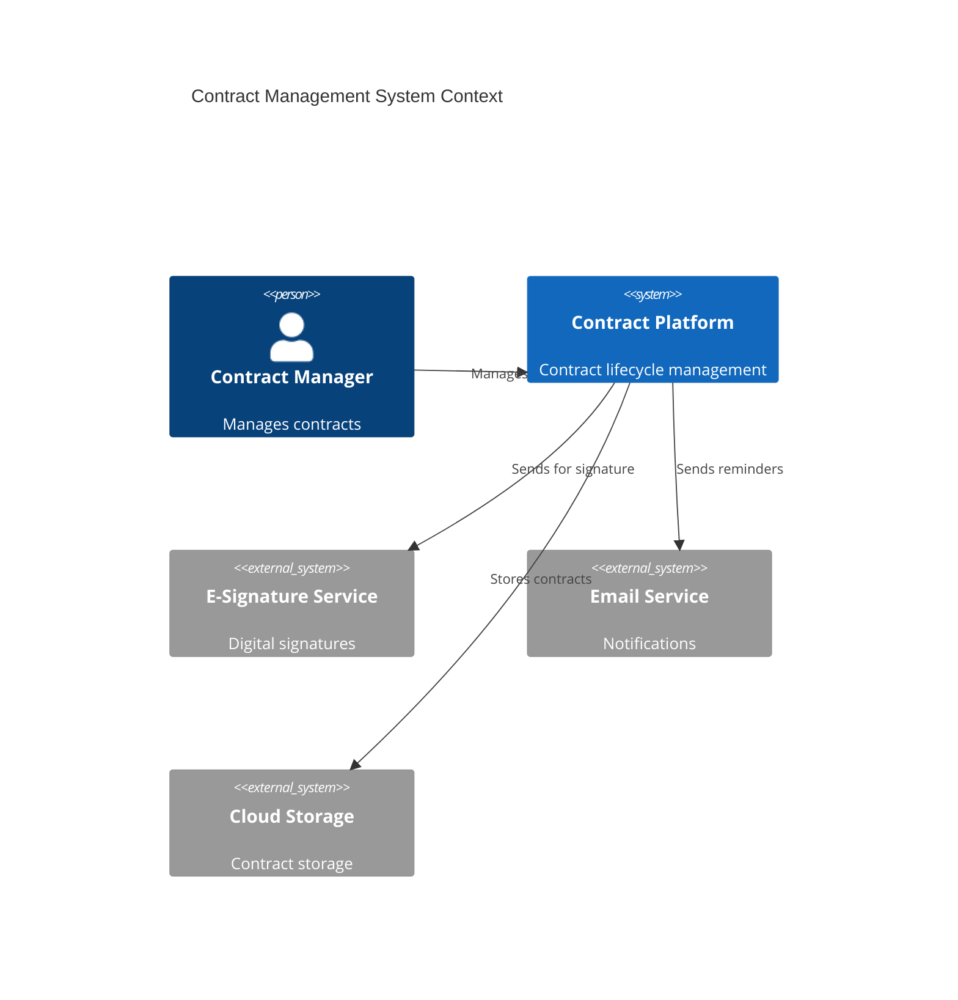
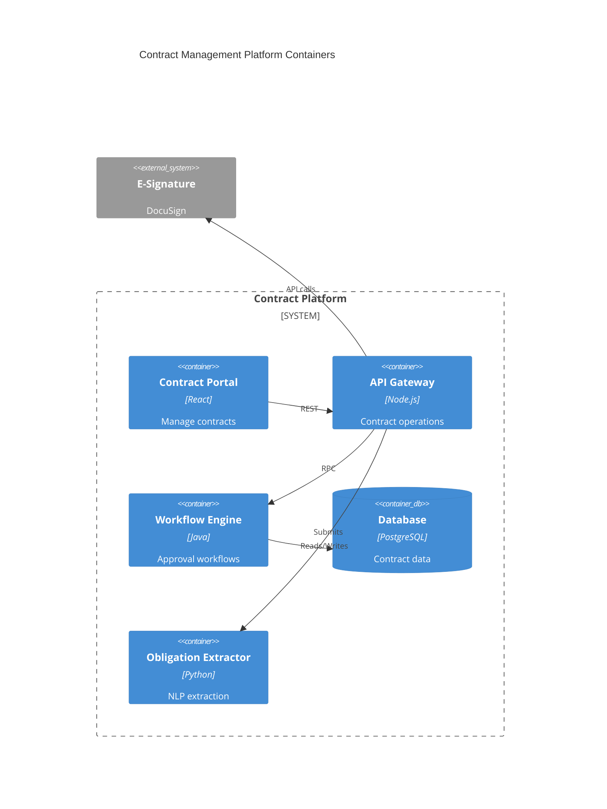
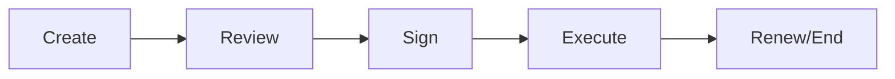

# Contract Management

Contract management and lifecycle.

## System Context

## System Containers

## Overview

## Features

- Contract templates
- Authoring tools
- Workflow management
- E-signature integration
- Version tracking
- Obligation tracking
- Renewal management
- Risk analysis
