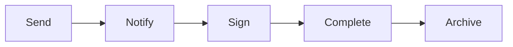

# Signature Management

Electronic signature management.

## Features

- E-signature integration
- Multi-party signing
- Signing sequences
- Audit trails
- Authentication methods
- Timestamp recording
- Document history
- Legal compliance
