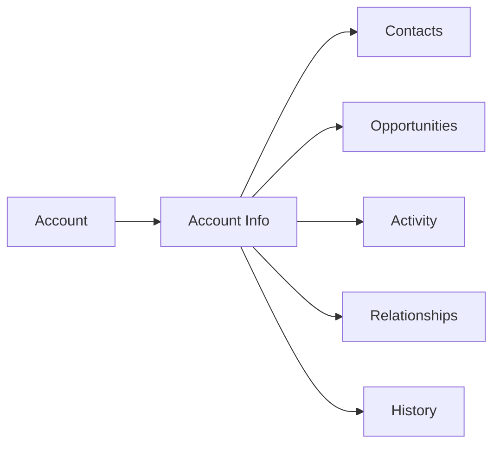

# Account Management

Manage customer accounts and multi-level relationships.

## Account Features

- Account profile
- Company information
- Billing information
- Industry and segment
- Account owner
- Contact hierarchy
- Organizational chart
- Parent/subsidiary relationships

## Account Information

- Company details
- Annual revenue
- Employee count
- Location information
- Website
- LinkedIn profile
- Stock ticker
- Custom fields

## Account Management

- Account segmentation
- Account teams
- Organizational structure
- Territory management
- Account health scoring
- Renewal tracking
- Expansion opportunities
