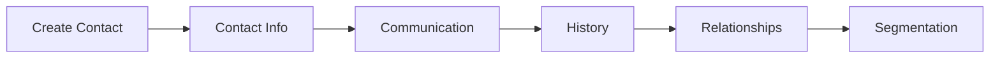

# Contact Management

Centralized contact database for managing all customer interactions.

## Contact Features

- Full contact information
- Multiple email addresses
- Phone numbers
- Social profiles
- Physical address
- Website and URLs
- Custom fields
- Contact photo

## Communication

- Email history
- Call logs
- Meeting notes
- Task tracking
- Activity timeline
- Document attachments
- Conversation history

## Organization

- Contact grouping
- Tags and segments
- Account association
- Team assignment
- Territory mapping
- Lead status
- Contact source
