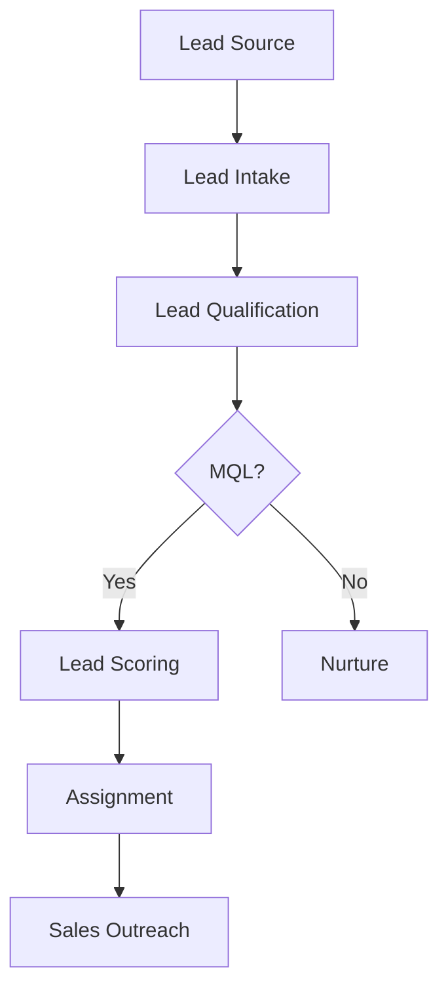

# Lead Management

Manage leads through qualification and assignment process.

## Lead Management

- Lead capture forms
- Lead imports
- Lead qualification
- Lead scoring
- Automated scoring
- Lead assignment
- Lead nurturing
- Lead recycle

## Lead Scoring

- Behavioral scoring
- Demographic scoring
- Company size
- Industry
- Engagement level
- Email opens
- Link clicks
- Website visits

## Lead Workflow

- Lead intake
- Qualification process
- Scoring calculation
- Auto-assignment
- Notification alerts
- Follow-up tasks
- Lead handoff
- CRM sync
