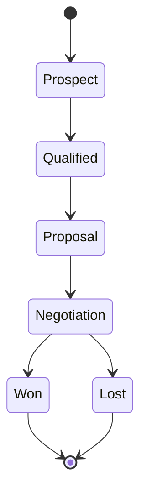

# Opportunity Pipeline

Manage sales opportunities through the entire sales pipeline.

## Opportunity Tracking

- Opportunity creation
- Stage tracking
- Probability estimation
- Deal size
- Close date
- Owner assignment
- Competition tracking
- Notes and documents

## Pipeline Management

- Custom pipeline stages
- Stage definitions
- Win/loss reasons
- Forecast categories
- Deal velocity
- Pipeline analysis
- Bottleneck identification

## Forecasting

- Sales forecast
- Stage probability
- Weighted forecast
- Pipeline analysis
- Trend analysis
- Quota management
