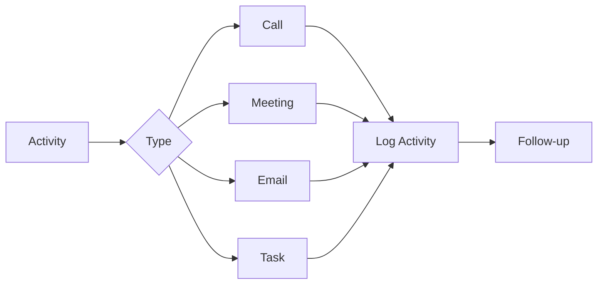

# Sales Activities

Comprehensive activity tracking for calls, meetings, and follow-ups.

## Activity Types

- Phone calls
- Face-to-face meetings
- Email communication
- Tasks and follow-ups
- Calls with notes
- Meeting agendas
- Meeting minutes
- Activity outcomes

## Activity Logging

- Quick logging
- Detailed logging
- Call recording
- Call transcription
- Meeting notes
- Outcome tracking
- Next steps
- Due dates

## Activity Management

- Activity history
- Timeline view
- Activity filters
- Activity search
- Bulk updates
- Activity reminders
- Calendar integration
