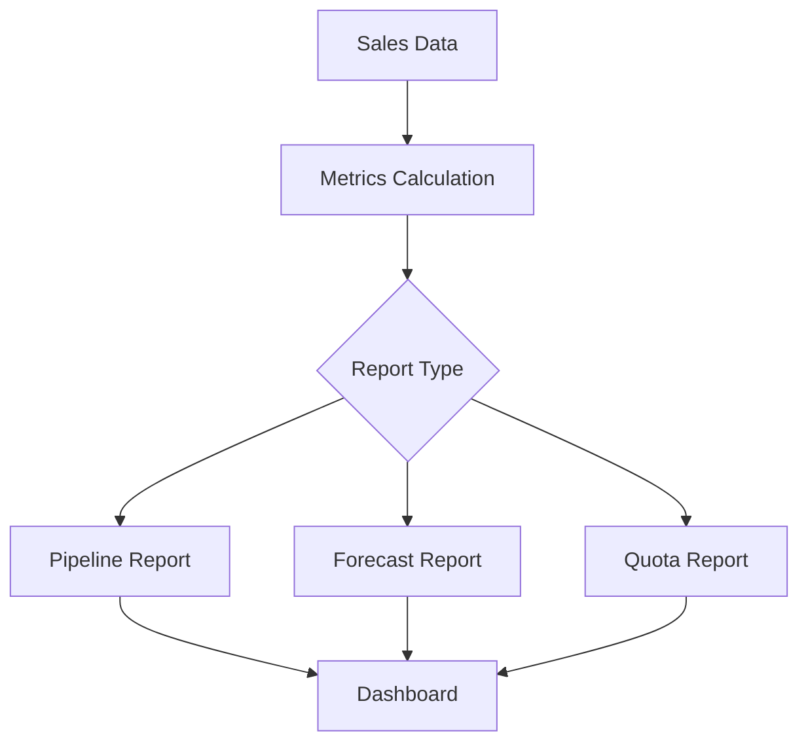

# Sales Analytics

Comprehensive sales analytics and performance reporting.

## Key Metrics

- Total pipeline value
- Win rate
- Average deal size
- Sales cycle length
- Conversion rates
- Activity metrics
- Quota attainment
- Revenue forecast

## Reports

- Sales pipeline report
- Forecast report
- Win/loss analysis
- Sales team report
- Activity report
- Forecast accuracy
- Territory report
- Competitive analysis

## Dashboards

- Executive dashboard
- Sales manager dashboard
- Sales rep dashboard
- Pipeline dashboard
- Forecast dashboard
- Custom dashboards
