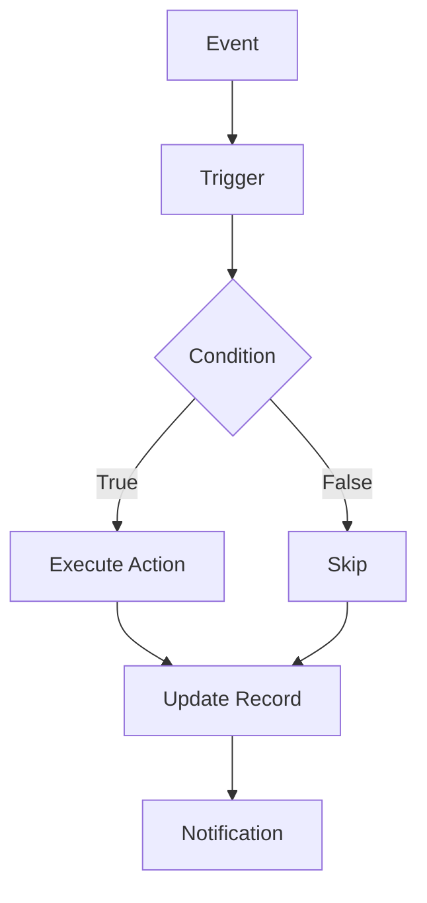

# Sales Automation

Automate sales processes and workflows.

## Automation Features

- Lead assignment automation
- Activity creation
- Email sequences
- Follow-up reminders
- Status updates
- Field updates
- Record creation
- List updates

## Workflow Automation

- Lead scoring workflows
- Opportunity workflows
- Territory assignment
- Task creation
- Notification rules
- Email templates
- Conditional logic

## Integration

- Email integration
- Calendar integration
- Website forms
- Marketplace integrations
- Custom webhooks
- Third-party apps
