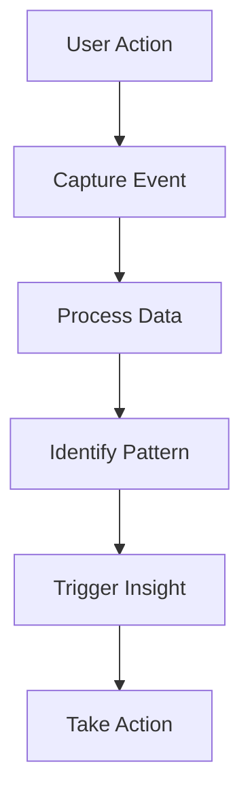

# Behavior Analytics

Analyze customer behavior and engagement patterns.

## Behavioral Metrics

- Session tracking
- Event tracking
- Funnel analysis
- Cohort analysis
- Flow analysis
- Retention analysis
- Churn analysis
- Engagement score

## Analysis Types

- Page view analysis
- Click analysis
- Scroll depth
- Time on page
- Form completion
- Video playback
- Download tracking
- Custom events

## Segmentation

- Behavior-based segments
- Engagement segments
- Purchase behavior
- Usage patterns
- Feature adoption
- Frequency segments
- Recency segments

## Visualization

- Flow diagrams
- Funnel charts
- Cohort tables
- Heatmaps
- Journey maps
- Segment views
