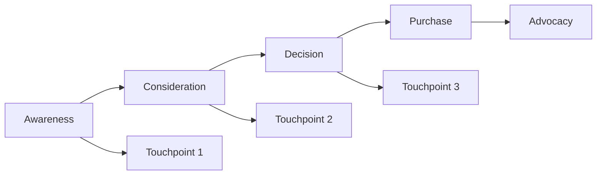

# Customer Journey

Map and analyze the complete customer journey.

## Journey Mapping

- Touch point identification
- Channel mapping
- Experience design
- Pain point identification
- Opportunity identification
- Journey visualization
- Journey editing
- Journey sharing

## Analysis

- Path analysis
- Conversion paths
- Dropout analysis
- Bounce point analysis
- Time between touch points
- Channel effectiveness
- Campaign impact
- Multi-touch attribution

## Stages

- Awareness stage
- Consideration stage
- Decision stage
- Purchase stage
- Retention stage
- Advocacy stage
- Custom stages

## Optimization

- Journey improvements
- Experience optimization
- Campaign alignment
- Channel optimization
- Messaging personalization
