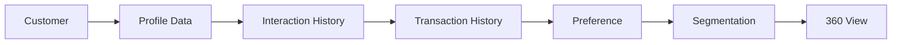

# Customer Profiles

Create unified customer profiles with all interactions and data.

## Profile Data

- Personal information
- Contact details
- Demographics
- Firmographics
- Location data
- Preferences
- Interests
- Custom attributes

## Interactions

- Website visits
- Page views
- Click tracking
- Form submissions
- Email engagement
- Chat history
- Call history
- Social activity

## Transactions

- Purchase history
- Order details
- Product purchased
- Amount spent
- Frequency
- Latest purchase
- Refunds
- Returns

## Profile Features

- Unified view
- Real-time updates
- Data enrichment
- Identity resolution
- Merge records
- Privacy controls
- Data retention
