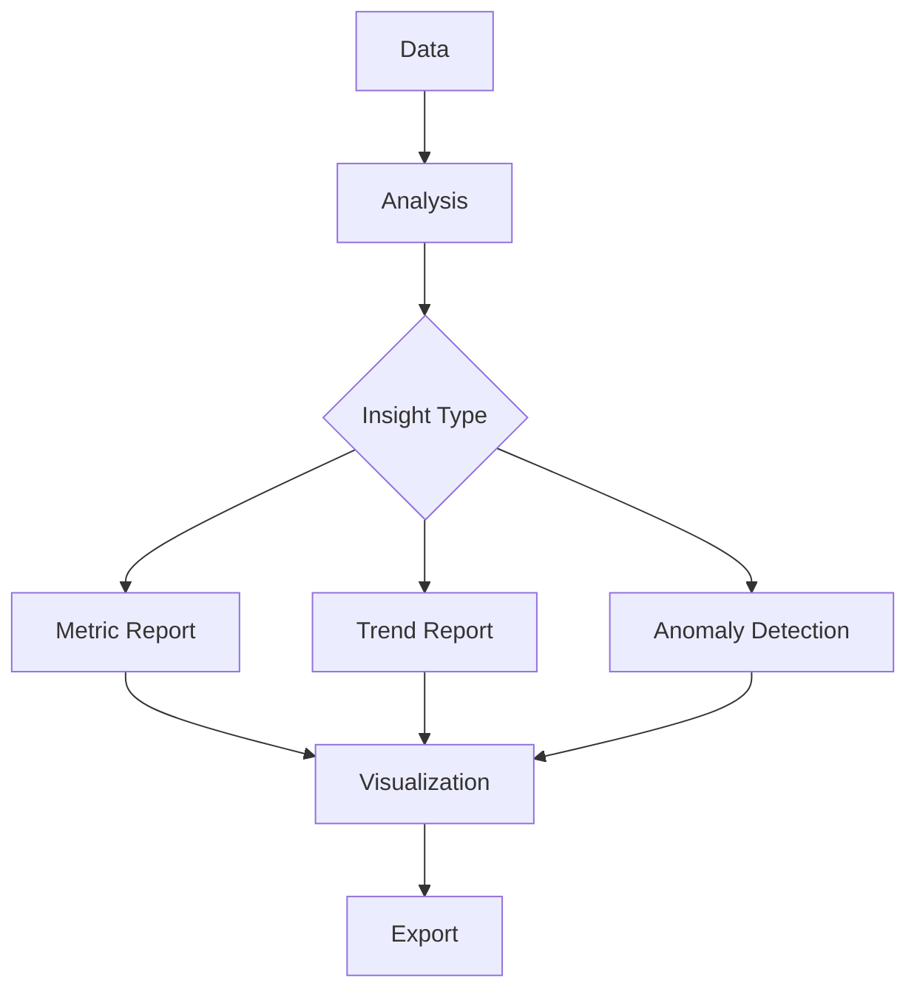

# Insights & Reports

Generate actionable insights and comprehensive reports.

## Report Types

- Customer health report
- Segment performance report
- Churn analysis report
- Lifetime value report
- Retention report
- Engagement report
- Campaign performance
- Custom reports

## Insights

- Key metrics
- Trends and patterns
- Anomalies
- Opportunity identification
- Risk identification
- Benchmark comparison
- Recommendations
- Actionable insights

## Dashboards

- Executive dashboard
- Marketing dashboard
- Sales dashboard
- Customer success dashboard
- Custom dashboards
- Real-time dashboards
- Mobile dashboards

## Reporting Features

- Scheduled reports
- Email delivery
- Data export
- Visualization options
- Filtering
- Drill-down
- Sharing
- Alerts
