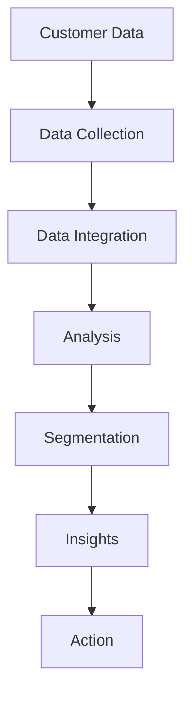

# Customer Insights

Deep customer insights and intelligence platform.

## Core Features

- Customer data platform
- Behavior analysis
- Predictive analytics
- Customer segmentation
- Journey mapping
- Sentiment analysis
- Churn prediction
- Lifetime value prediction

## Data Sources

- Website tracking
- App tracking
- CRM data
- Transaction data
- Customer service data
- Email engagement
- Social media
- Third-party data

## Integration Points

- **Analytics**: Data source
- **CRM**: Customer data
- **Notifications**: Insight-based actions
- **Reporting**: Insight reports
