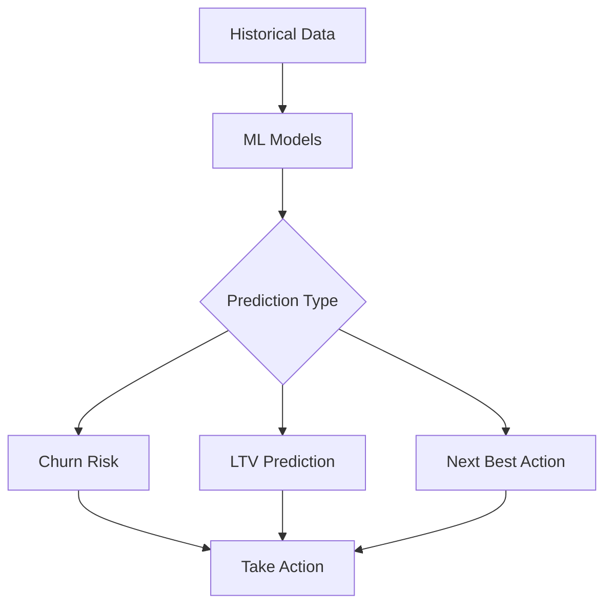

# Predictive Analytics

Use machine learning to predict customer behavior and outcomes.

## Predictive Models

- Churn prediction
- Lifetime value
- Next purchase prediction
- Product recommendation
- Propensity models
- Lookalike modeling
- Segmentation prediction
- Engagement prediction

## ML Features

- Auto model training
- Model accuracy
- Model explainability
- Real-time scoring
- Batch scoring
- Model versioning
- Performance monitoring
- Model retraining

## Use Cases

- Retention campaigns
- Upsell/cross-sell
- Customer prioritization
- Resource allocation
- Risk identification
- Opportunity identification
- Personalization
- Channel selection

## Performance

- Prediction accuracy
- False positives
- False negatives
- Model precision
- Model recall
- ROI impact
