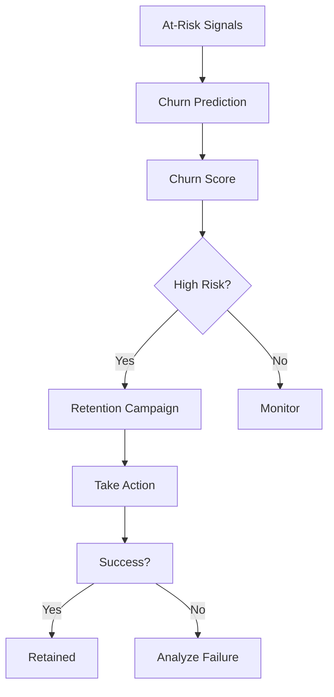

# Retention & Churn

Predict and prevent customer churn.

## Churn Prediction

- Churn risk scoring
- Early warning signals
- Contributing factors
- Risk segmentation
- Probability scoring
- Timeline prediction
- Retention propensity

## Risk Indicators

- Usage decline
- Engagement decline
- Support tickets
- Refund requests
- Payment failures
- Feature adoption decline
- Login frequency
- Email engagement

## Retention Programs

- Win-back campaigns
- Special offers
- Dedicated support
- Product improvements
- Feature requests
- Feedback sessions
- Executive outreach

## Monitoring

- Churn rate trends
- Retention cohorts
- Campaign effectiveness
- Program ROI
- Customer feedback
- Reasons for churn
- Lessons learned
