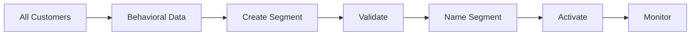

# Segmentation

Create meaningful customer segments for targeted actions.

## Segmentation Types

- Demographic segments
- Behavioral segments
- RFM segments
- Psychographic segments
- Geographic segments
- Life cycle segments
- Usage-based segments
- Value-based segments

## Segment Features

- Dynamic segments
- Static snapshots
- Segment overlaps
- Size tracking
- Growth tracking
- Segment performance
- Activation history
- Archive segments

## Use Cases

- Targeted campaigns
- Personalization
- Product recommendations
- Service tier assignment
- Retention programs
- Expansion programs
- Win-back campaigns

## Management

- Create segments
- Test segments
- Activate segments
- Monitor performance
- Refine criteria
- Share segments
- Version control
