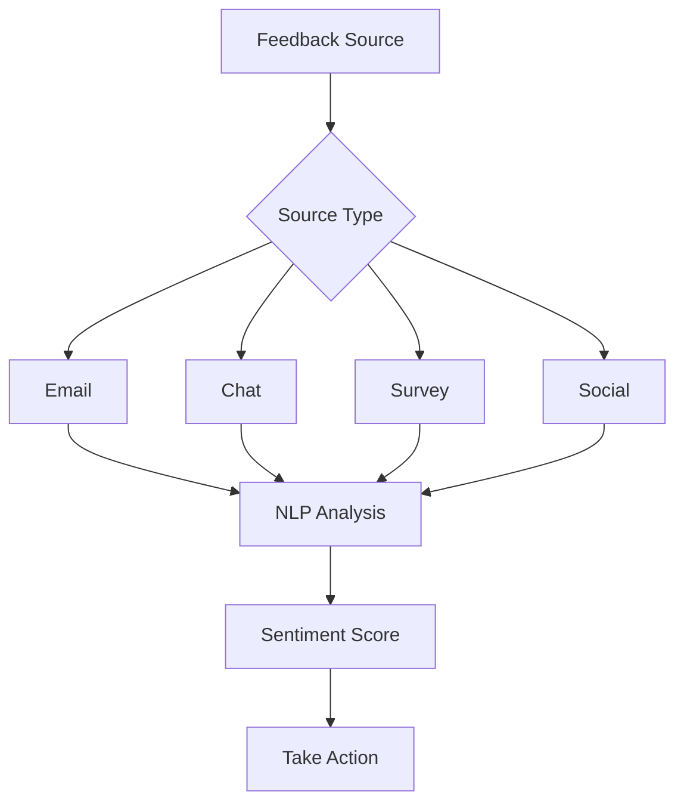

# Sentiment Analysis

Analyze customer sentiment from various sources.

## Sentiment Sources

- Email feedback
- Chat conversations
- Customer surveys
- Social media
- Reviews
- Support tickets
- Comments
- Custom text

## Sentiment Analysis

- Sentiment scoring
- Emotion detection
- Topic extraction
- Intent detection
- Urgency detection
- Language detection
- Real-time analysis
- Batch analysis

## Insights

- Overall sentiment
- Sentiment trends
- Sentiment by segment
- Sentiment by channel
- Topic sentiment
- Competitor mentions
- Brand health
- Issue detection

## Actions

- Alert on negative sentiment
- Escalate urgent issues
- Route to appropriate team
- Trigger campaigns
- Personalize experience
- Improve product
