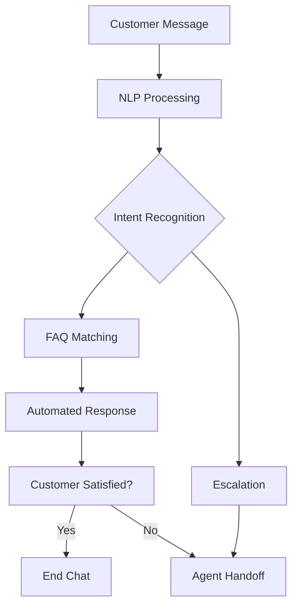

# AI Chatbot

Intelligent chatbot for automated customer support and lead generation.

## Chatbot Features

- Natural language understanding
- Intent recognition
- Entity extraction
- Multi-turn conversations
- Context awareness
- Sentiment analysis
- Escalation routing
- Learning from interactions

## Training & Configuration

- Train on FAQs
- Custom intents
- Entity definitions
- Response templates
- Escalation rules
- Personality settings
- Knowledge integration

## Analytics

- Conversation metrics
- Intent distribution
- Escalation rates
- Resolution rates
- Satisfaction scores
- Common queries
