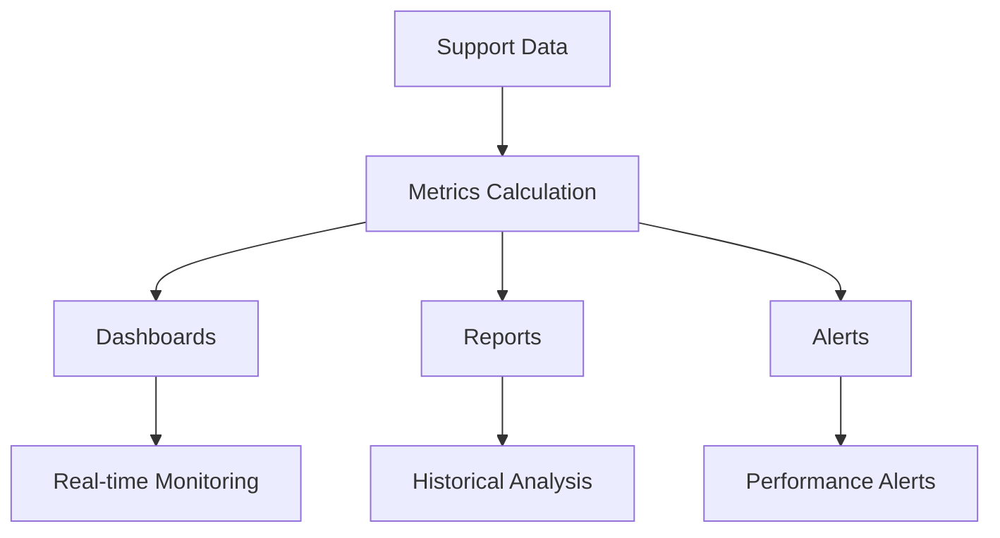

# Analytics & Reporting

Comprehensive analytics and reporting for support team performance.

## Key Metrics

- Response time
- Resolution time
- First contact resolution
- Customer satisfaction (CSAT)
- Net promoter score (NPS)
- Ticket volume
- Agent productivity
- Queue depth

## Reports

- Performance reports
- Agent reports
- Customer reports
- SLA reports
- Channel reports
- Trend analysis
- Forecast reports
- Custom reports

## Dashboards

- Real-time monitoring
- Agent dashboards
- Team dashboards
- Manager dashboards
- Executive dashboards
- Custom dashboards
