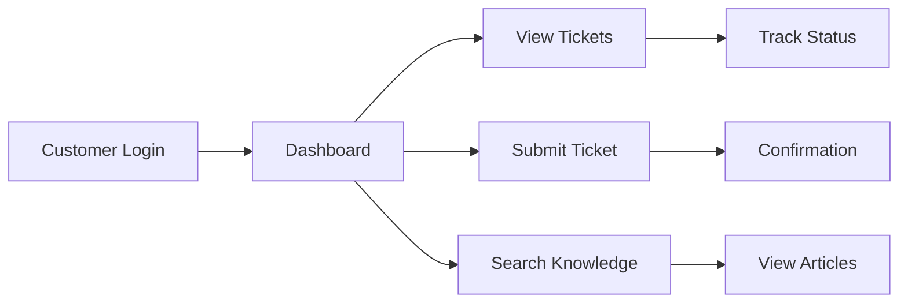

# Customer Portal

Customer-facing portal for support ticket management and knowledge access.

## Portal Features

- Customer login
- Ticket submission
- Ticket tracking
- Knowledge base access
- Community forums
- Profile management
- Payment history
- Usage statistics

## Functionality

- Create support tickets
- View ticket history
- Track ticket status
- Download attachments
- Search knowledge base
- Browse FAQs
- Provide feedback
- Rate solutions

## Customization

- Branding
- Theme customization
- Custom fields
- Organization structure
- Access control
- Widget selection
