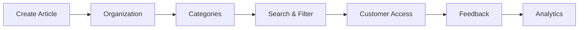

# Knowledge Base

Comprehensive knowledge base for customer self-service support.

## Features

- Article editor
- Rich text formatting
- Code syntax highlighting
- Embedded media
- Version control
- Draft workflow
- Publishing schedule
- Access control

## Organization

- Categories and subcategories
- Tags
- Collections
- Related articles
- Article hierarchy
- Cross-references

## Self-Service

- Full-text search
- Faceted search
- Article recommendations
- Feedback ratings
- Helpful voting
- Comments
- Related articles

## Analytics

- Article views
- Search queries
- Helpfulness ratings
- Missing content gaps
- Usage trends
