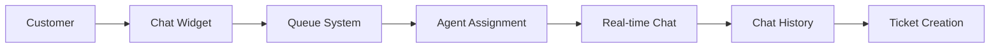

# Live Chat

Real-time chat interface for instant customer support.

## Chat Features

- Customizable chat widget
- Queue management
- Agent availability
- Chat routing
- Conversation history
- File sharing
- Typing indicators
- Read receipts

## Advanced Features

- Canned responses
- Chat transfer
- Agent assignment
- Chat analytics
- Chatbot escalation
- Offline messaging
- Chat ratings
- Transcript storage

## Configuration

- Widget styling
- Greeting messages
- Department routing
- Business hours
- Offline message
- Pre-chat forms
