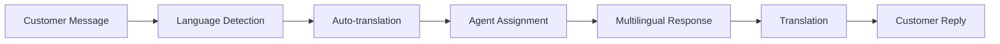

# Multi-language Support

Global support with multi-language and multi-region capabilities.

## Language Support

- 50+ supported languages
- Auto language detection
- Translation API integration
- Manual language selection
- Language-based routing
- Locale-specific content

## Regional Features

- Regional customer groups
- Time zone handling
- Currency support
- Regional compliance
- Geo-based routing
- Regional SLAs

## Implementation

- Automatic translation
- Human translation option
- Translation memory
- Glossary management
- Native speaker agents
- Regional preferences
