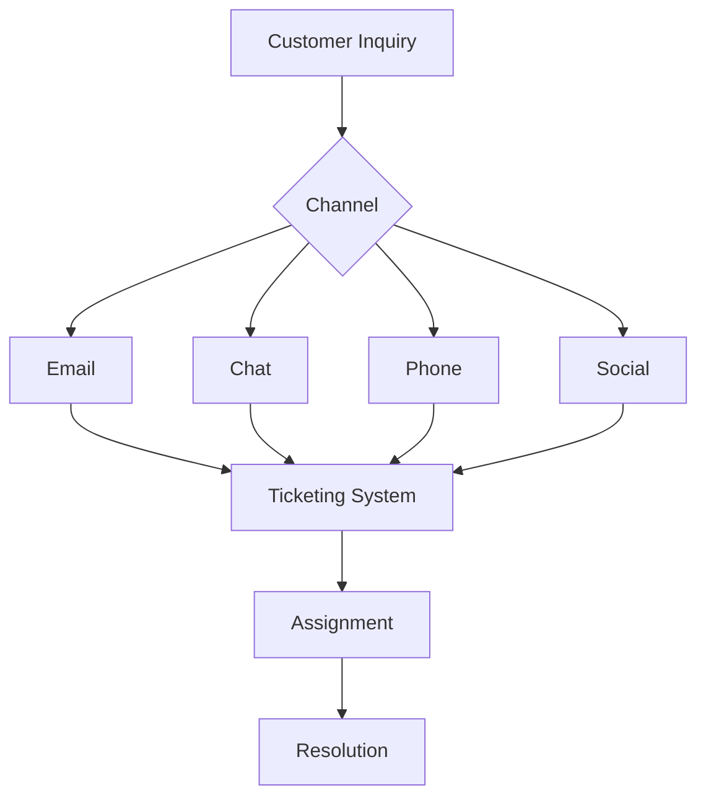

# Customer Support

Comprehensive customer support platform for managing inquiries across all channels.

## Support Channels

- Email support
- Live chat
- Helpdesk ticketing
- Social media monitoring
- Phone integration
- Knowledge base
- Community forums
- Chatbots

## Core Features

- Unified inbox
- Ticket management
- SLA tracking
- Knowledge base
- AI-powered suggestions
- Team collaboration
- Customer portal
- Analytics and reporting

## Integration Points

- **Notifications**: Alert handling
- **User Management**: Customer profiles
- **Analytics**: Support metrics
- **Content**: Knowledge base articles
